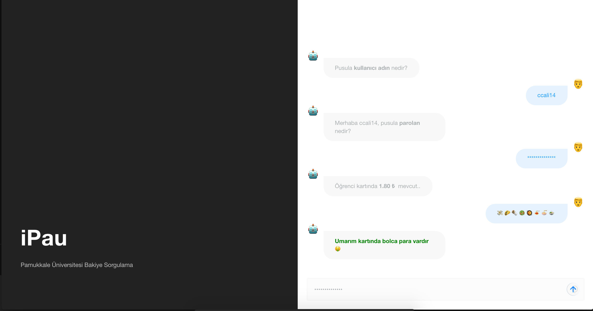

# iPau

**Pamukkale Üniversitesi Bakiye Sorgulama**

_Kendi iPau sunucunu oluşturabilirsin_

# API Kullanımı

- POST
  - <https://ipau.me/>
    - uid: required (Kullanıcı adı)
    - pass: required (Parola)
